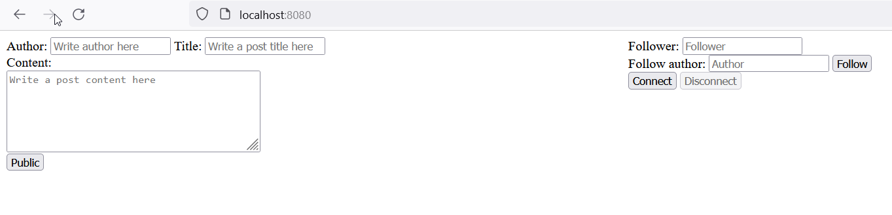
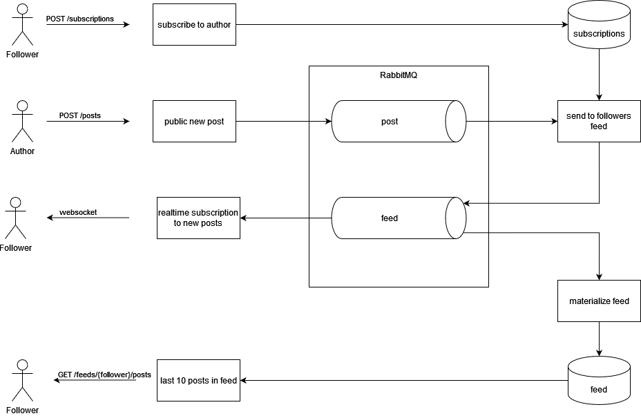

# highload-architect-homework (rabbitmq)

## Requirements

- Docker
- Docker Compose

## Run

```shell
docker-compose up
```

## Test

Перейти на страницу http://localhost:8080/



Чтобы:
 - опубликовать новый пост - нужно ввести логин автора, заголовок, содержимое и нажать Public;
 - подписаться - нужно ввести логин подписчика, логин автора и нажать Follow;
 - смотреть ленту пользователя - нужно ввести логин подписчика и нажать Connect.

## Architecture



## Scaling

Для масштабирования сервиса можно использовать RabbitMQ-плагин consistent_hash_exchange. Для каждого инстанса
приложения задать свою очередь, в которую будет перекладываться часть постов. Таким образом несколько инстансов
смогут обрабатывать посты авторов параллельно и рассылать их фоловерам. Эти очереди целесообразно расположить на
разных инстансах RabbitMQ, объединённых в кластер, таким образом распределяя нагрузку между ними.
